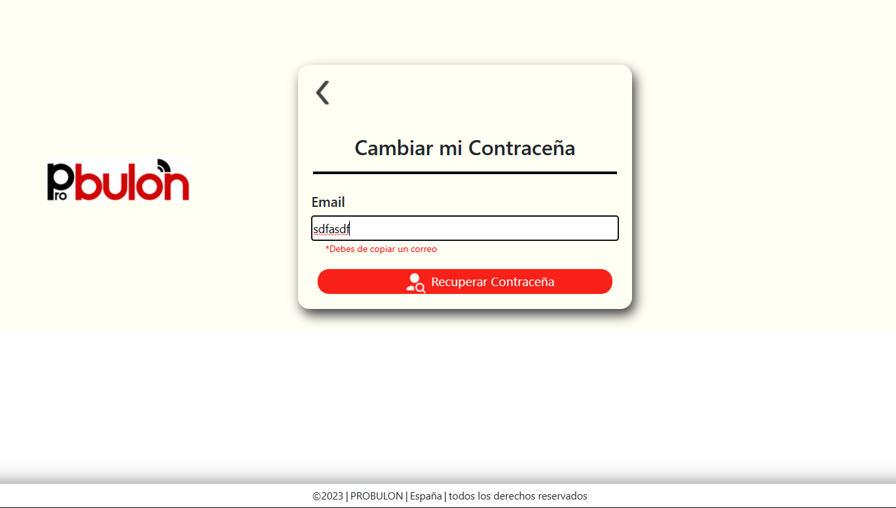

# 

**Finished login design**

## 

**Validators working correctly**

## 

**functional alert**

## 

**Screen to send the code and retrieve the password, it is ready for the backend**

## 

**displays a list of existing users**

## 

**If it is not written correctly an email gives the warning**

## 

**Note: the button only works if an email is copied well**

**Base screen to recover password**
### 

