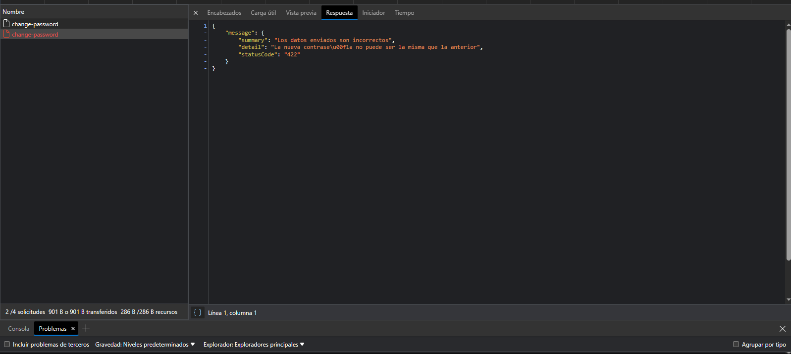

# 

**The login screen is already integrated with the backend**

## 

**Validators working correctly**

## 

**functional alert**

## 

**Integration with the Backend when the user is valid**
## 

**Integration with the Backend when the user is invalid**
## 

**Screen to send the message of the code to the mail is already integrated with the Backend**

## 

**If it is not written correctly an email gives the warning**

## 

**Integration with the Backend When it is valid**
## 

**Integration with the Backend When it is invalid**
##    Genera una alerta automatica

**Note: the button only works if an email is copied well**

**The screen to confirm the change of contraceña is already integrated with the backend**

## 

**Integration with the Backend When it is valid**

## 

**Integration with the Backend When it is invalid**

## 

**What is missing: They are missing that the alerts are intengren with the backend**

